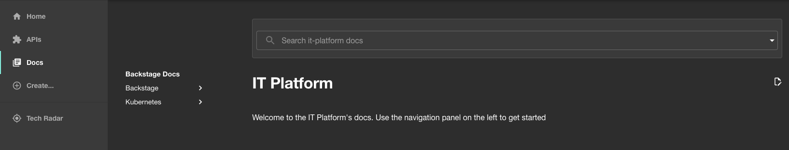

# Rendering docs in Backstage

## Prerequisites

[A vanilla backstage](./vanilla-backstage.md)

## Objective
Populating the Docs of Backstage with the article you are reading and many more.

## The journey

The Backstage feature that allows us to render documentation is [TechDocs](https://backstage.io/docs/features/techdocs/).

The goal is to quickly get up and running with a working solution, and iterate on it later on. Therefore we opt for the [Basic architecture](https://backstage.io/docs/features/techdocs/architecture#basic-out-of-the-box), where the same container is in charge on generating and publishing the documentation.

### Enabling Techdocs

In the [last article](./vanilla-backstage.md) a basic *Backstage* web app was configured. To enabled Techdocs the `values.yaml` there created can be extended with the following content:
```yaml
backstage:
  backstage:
      techdocs:
        builder: local
        generator:
          runIn: local
        publisher:
          type: local 
```

In addition, since the container where *Backstage* is running will also have to generate the documentation it must have mkdocs installed. For that a custom image must be built with the following Dockerfile:

### Building a mkdocs capable image

```dockerfile
FROM ghcr.io/backstage/backstage:latest
USER root
RUN --mount=type=cache,target=/var/cache/apt,sharing=locked \
    --mount=type=cache,target=/var/lib/apt,sharing=locked \
    apt-get update && \
    apt-get install -y --no-install-recommends python3-pip
RUN pip install mkdocs-techdocs-core
USER node
```

It is a simple *Dockerfile* that extends the latest [Backstage image](https://github.com/backstage/backstage/pkgs/container/backstage) with *pip* and *mkdocs-techdocs-core*. The base image uses the `node` user but this user is not privileged enough to install dependencies, that is why the user is temporarily changed to `root`.

The image can be built with the following command:
```sh
docker build . -t backstage:mkdocs
```

Then, to use the image the following content should be added to `values.yaml`:
```yaml
backstage:
  backstage:
    image:
      pullPolicy: IfNotPresent
      registry: ""
      repository: "backstage"
      tag: "mkdocs"
```

And, if the kubernetes cluster is running in `kind` the image must be added to the nodes:
```sh
kind load docker-image backstage:mkdocs
```

### Importing docs to Backstage

Now that the infrastructure is ready it is time to import docs to Backstage. The following [documentation](
https://backstage.io/docs/features/techdocs/creating-and-publishing#enable-documentation-for-an-already-existing-entity) explains how to do it.

First of all, an entrypoint to a repository is needed. Backstage uses entities for its service catalog and they can point to documentation. This [page](https://backstage.io/docs/features/software-catalog/system-model/) is recommented to understand Backstage's entities. And their YAML file formats are explained [here](https://backstage.io/docs/features/software-catalog/descriptor-format#kind-domain).

The following yaml file satisfies the requirements.
```yaml
apiVersion: backstage.io/v1alpha1
kind: Domain
metadata:
  name: it-platform
  description: A blog in the form of a service catalog
  annotations:
    backstage.io/techdocs-ref: dir:../..
spec:
  owner: abaguas
```
The most important bit is the `backstage.io/techdocs-ref` annotation, it must point to a directory containing a `docs` folder, as well as a `mkdocs.yml`. I place those in the root of my repository.

In the [mkdocs](https://www.mkdocs.org/getting-started/) configuration you should include the path to your pages under the `nav` key. For example:
```yaml
site_name: Backstage Docs
site_description: Main documentation for Backstage

nav:
  - example: example.md

plugins:
  - techdocs-core
```
And a `index.md` file must also be present in the docs directory. This is the first page that will be rendered.

Finally, Backstage should know about the repository where these files are hosted. The following will do it

```yaml
backstage:
  backstage:
    appConfig:
      catalog:
        rules:
          - allow: [API, Component, Domain, Location, Resource, System]
        locations:
          - type: url
            target: https://github.com/abaguas/itplatform/blob/main/catalog/domains/it-platform.yaml
```

After a long journey it is time to generate and apply all the manifests. Here is the final result:

