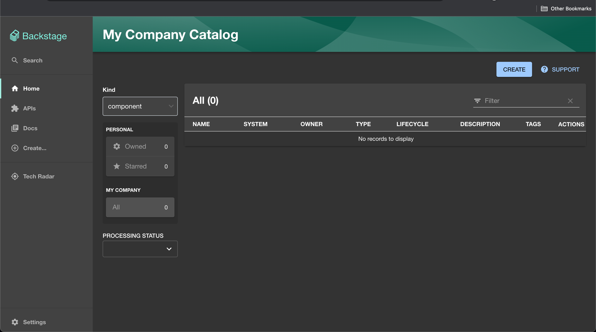
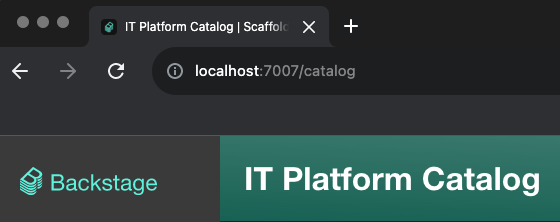

# Vanilla Backstage in Kubernetes

## Prerequisites

[A kubernetes cluster](../kubernetes/local-development.md)

## Objective
Have a backstage instance running in Kubernetes and visit it on a browser

## The journey

The easiest way to deploy an application in Kubernetes is with a Helm Chart, and Backstage provides [one](https://github.com/backstage/charts/tree/main/charts/backstage) for us.

We can create a chart that uses the chart above as a dependency, as shown in this `Chart.yaml` (don't forget to update the version):
```yaml
apiVersion: v2
name: backstage
description: A Helm chart for deploying a Backstage application
dependencies:
  - name: backstage
    repository: https://backstage.github.io/charts
    version: 0.22.5
icon: https://raw.githubusercontent.com/cncf/artwork/master/projects/backstage/icon/color/backstage-icon-color.svg
type: application
version: 0.1.0
```

Then the manifests can be generated:
```sh
brew install helm
helm repo add backstage https://backstage.github.io/charts
helm dependency update
helm package . && helm template backstage backstage-0.1.0.tgz -n backstage > manifests.yaml
```

And we can apply them:
```sh
(⎈|kind-kind:backstage)➜  ~ k create namespace backstage
(⎈|kind-kind:backstage)➜  ~ kaf manifests.yaml
service/backstage created
deployment.apps/backstage created
```

A pod is now running:
```sh
(⎈|kind-kind:backstage)➜  ~ kgp -w
NAME                         READY   STATUS    RESTARTS   AGE
backstage-5b6d56488c-xnkb2   1/1     Running   0          4s
```

The next step is to learn which port is exposed and port forward it:
```sh
(⎈|kind-kind:backstage)➜  ~ kgs
NAME        TYPE        CLUSTER-IP    EXTERNAL-IP   PORT(S)    AGE
backstage   ClusterIP   10.96.65.50   <none>        7007/TCP   2m53s
(⎈|kind-kind:backstage)➜  ~ k port-forward services/backstage 7007:7007
Forwarding from 127.0.0.1:7007 -> 7007
Forwarding from [::1]:7007 -> 7007
```

Backstage can now be accessed on [localhost:7007](localhost:7007), awesome!


Finally, the instance can be customized to show the organization name, instead of the default `My Company`. For that a `app-config.yaml` is necessary.

After reading the [app-config's configuration options](https://github.com/backstage/backstage/blob/master/packages/create-app/templates/default-app/app-config.yaml.hbs) it becomes clear that the `organization.name` value should be modified. So the `values.yaml` should look as follows:
```yaml
backstage:
  backstage:
      organization:
        name: IT Platform
```

However, there are a few mandatory values that we also need to fill, leading a `values.yaml` as:
```yaml
backstage:
  backstage:
    appConfig:
      app:
        baseUrl: http://localhost:3000
      backend:
        baseUrl: http://localhost:7007
        database:
          client: better-sqlite3
          connection: ':memory:'
      organization:
        name: IT Platform
```

* `app.baseUrl` is not important, any value can be used as only the backend is exposed.
* `backend.baseUrl` should be `http://localhost:7007` since the backend is exposed on this port by default
* `database` can have multiple values but an in-memory sqlite database was chosen to keep a simple monolith deployment. We are not yet concerned with persistence

After generating the manifests and applying the organization's name can be seen in the Backstage web app:

```sh
helm package . && helm template backstage backstage-0.1.0.tgz -n backstage > manifests.yaml
```
```sh
(⎈|kind-kind:backstage)➜  ~ kaf manifests.yaml
configmap/backstage-app-config created
service/backstage configured
deployment.apps/backstage configured
```


